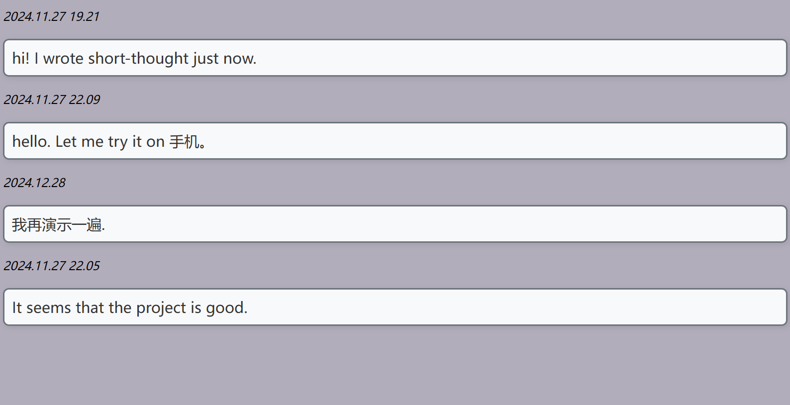

# short-thought

  
这个 repo 的名字是 `short-thought`, 但我又更想把它当作 "short-diary".

## Intro
本 repo 的代码含量很小, 只有一个不到 100 行代码的单文件 `to_page.c`,   
它的作用是: 遍历指定文件夹, 将里面每个文件都读取一下, 合并一起输出用来展示这些内容的 html 代码.  
`hello.html` 算是生成代码的模板.  

## 作用
本 repo 利用 GitHub Actions, 在每次 push 代码或 thought 文本的时候, 会编译并运行 `to_page.c`,  
保存生成的 html 至分支 `gh-pages`, 于是再将内容部署到 GitHub Pages 上.  
当我每次提交些类似于想法的文本后, 等一会儿, 它会自动运行完程序并自动部署到 GitHub Pages,  
再当我访问这些网页时, 就能看到这些以网页形式展示的内容. 就像一个公开的小日记本.
  